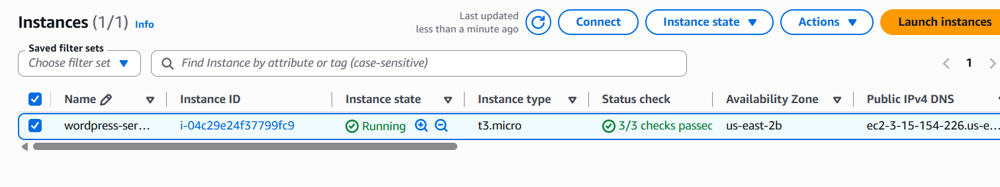
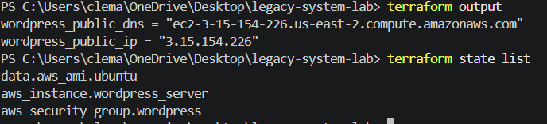
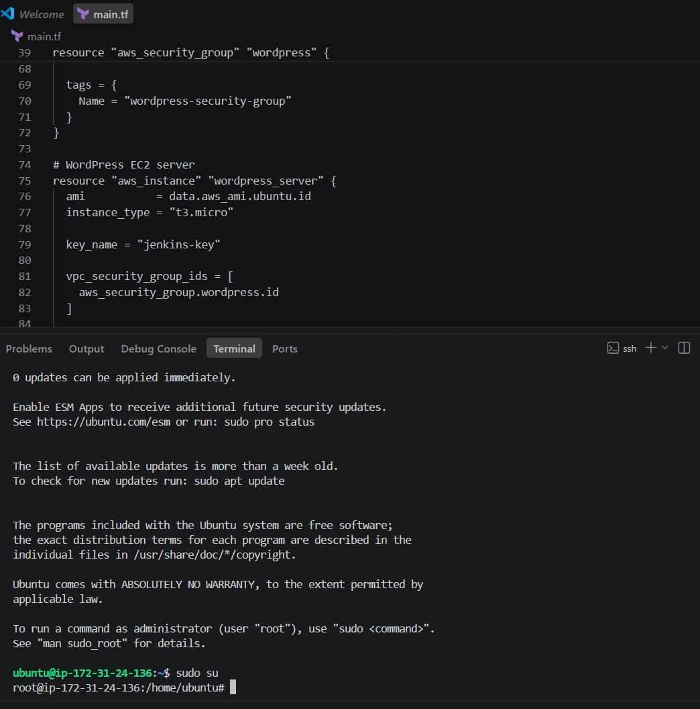
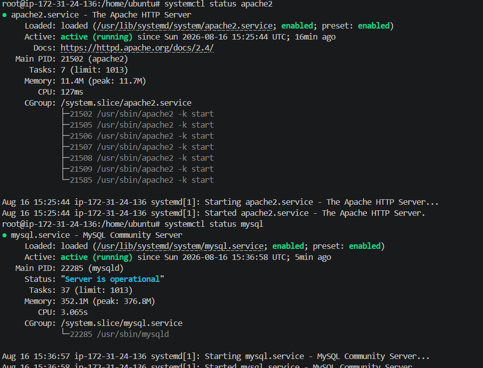
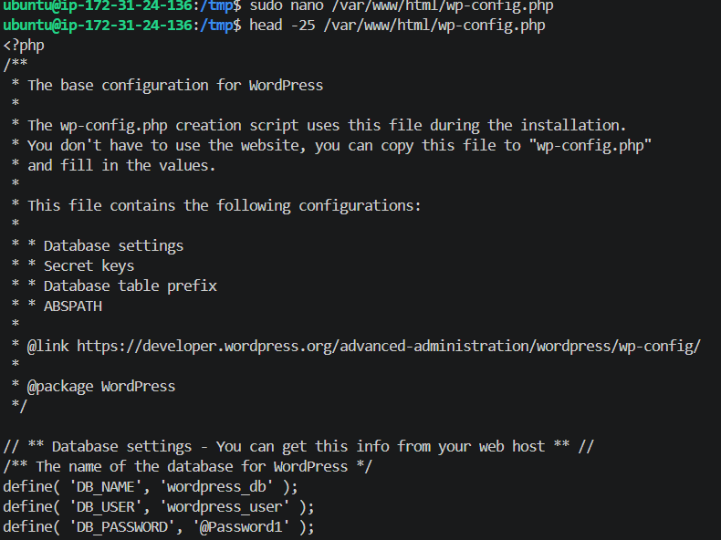
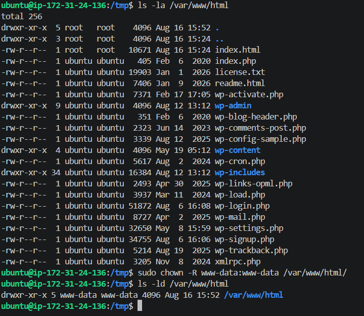
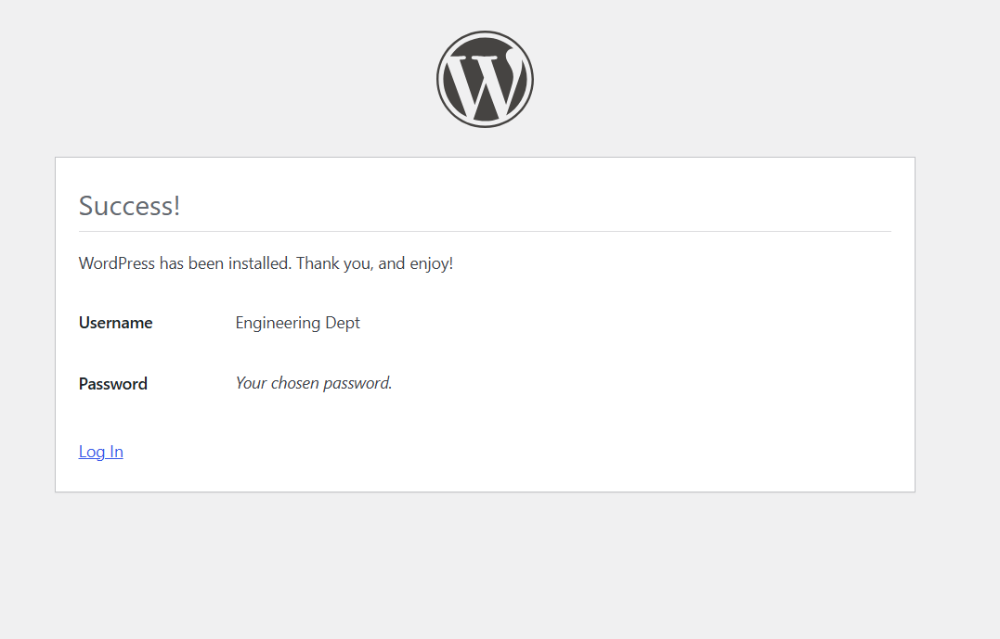
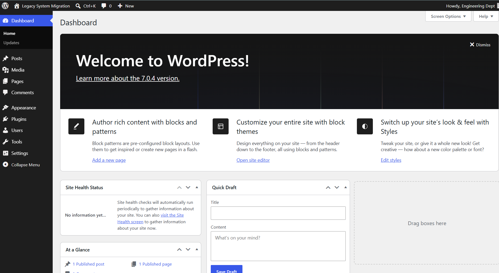
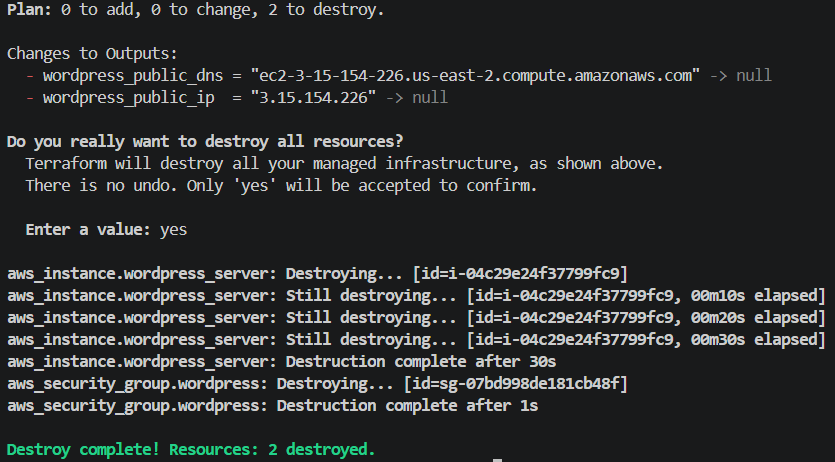

# Legacy System Modernization Lab

## Project Overview

This project demonstrates the deployment of a WordPress application stack on AWS as a hands-on cloud infrastructure project.

The goal was to provision an Ubuntu EC2 server using **Terraform**, configure the server with **Apache, PHP, and MySQL**, deploy **WordPress**, verify that the application was operational, and finally remove the infrastructure using Terraform.

Rather than manually creating the infrastructure through the AWS Management Console, Terraform was used to define and provision the AWS resources as code.

---

## Architecture

The application stack used the following architecture:

```text
                    Internet
                       |
                       v
              AWS Security Group
               HTTP (80) / SSH
                       |
                       v
                 AWS EC2 Instance
                   Ubuntu Linux
                       |
          +------------+------------+
          |            |            |
          v            v            v
       Apache          PHP         MySQL
          |                         |
          v                         v
      WordPress  <------------> wordpress_db
```

Apache served the web application, PHP provided the server-side runtime required by WordPress, and MySQL stored the application's data.

---

## Skills Demonstrated

- Infrastructure as Code (IaC)
- AWS EC2 provisioning
- Terraform
- Linux server administration
- SSH remote administration
- Apache web server configuration
- PHP runtime installation
- MySQL database administration
- WordPress deployment
- Linux file ownership and permissions
- Git version control
- GitHub project documentation
- Cloud resource cleanup

---

## Technologies Used

| Technology | Purpose |
|---|---|
| AWS EC2 | Cloud compute instance |
| Terraform | Infrastructure provisioning and lifecycle management |
| Ubuntu Linux | Server operating system |
| Apache | Web server |
| PHP | Server-side runtime for WordPress |
| MySQL | Relational database |
| WordPress | Web application/CMS |
| SSH | Secure remote server access |
| Git | Version control |
| GitHub | Source control and project documentation |

---

# Deployment Walkthrough

## 1. Infrastructure Provisioning with Terraform

I used Terraform to provision the AWS infrastructure instead of manually creating the resources through the AWS Console.

The Terraform configuration defined the EC2 instance and security group required for the WordPress server. An existing AWS EC2 key pair was associated with the instance to allow SSH access.

After applying the Terraform configuration, the EC2 instance entered the **Running** state and passed its AWS status checks.



*AWS EC2 instance running successfully after infrastructure provisioning.*

Terraform outputs were used to retrieve the public IP address and public DNS name of the server. The Terraform state also confirmed that the EC2 instance, security group, and Ubuntu AMI data source were being managed or referenced by the configuration.



*Terraform output and state information used to verify the provisioned infrastructure.*

---

## 2. Server Preparation and SSH Access

After provisioning the EC2 instance, I connected to the Ubuntu server using SSH.

This provided remote command-line access to the instance so that the operating system and application stack could be configured.



*SSH session established with the Ubuntu EC2 instance.*

The Ubuntu package repositories and installed packages were then updated before application software was installed.

Keeping the operating system updated helps ensure that current package versions and security updates are available.

---

## 3. Web Stack Installation

WordPress requires several components to operate. I installed:

- **Apache** to serve web content over HTTP.
- **PHP** to execute the server-side WordPress application code.
- **MySQL** to store WordPress application data.

After installation, Apache and MySQL were started and configured to start automatically with the server.

I verified both services with `systemctl`.



*Apache and MySQL verified as active and running.*

This verification was important before continuing because WordPress depends on both the web server and database service.

---

## 4. Database Configuration

MySQL was secured before creating the WordPress database.

The security configuration included actions such as removing anonymous users, disabling remote root login, removing the default test database, and reloading privilege tables.

I then created a dedicated database named:

```text
wordpress_db
```

A separate MySQL user was created for WordPress and granted privileges specifically to the WordPress database.

Using a dedicated application account avoids requiring WordPress to connect to the database using the MySQL root account.



*MySQL verification showing the dedicated `wordpress_db` database.*

Database credentials are not stored in this repository or displayed in the project documentation.

---

## 5. WordPress Deployment

WordPress was downloaded and extracted on the Ubuntu server.

The application files were then moved into Apache's document root:

```text
/var/www/html
```

The ownership of the web directory was assigned to the Apache service account (`www-data`) so that the web server could properly access the application files.



*WordPress files deployed to Apache's document root with the appropriate ownership.*

The WordPress configuration file was then configured with the database name, database user, database password, and local database host.

Sensitive database credentials have intentionally been excluded from this repository.

After configuration, Apache was restarted so the application could be served with the completed configuration.

---

## 6. Final Application Verification

After the server, database, and WordPress configuration were completed, I accessed the EC2 instance through its public IP address in a web browser.

The WordPress installation process completed successfully.



*WordPress confirming that the application installation completed successfully.*

I then logged into the WordPress administration dashboard.



*Successfully authenticated WordPress dashboard, confirming the application stack was operational.*

Reaching the dashboard verified that the major components were working together successfully:

```text
Browser
   |
   v
Apache
   |
   v
PHP / WordPress
   |
   v
MySQL
```

At this point, the deployed WordPress application was operational on the AWS EC2 instance.

---

## 7. Infrastructure Cleanup

After validating the completed deployment, I used Terraform to destroy the AWS infrastructure created for the project.

```bash
terraform destroy
```

Terraform identified the managed resources scheduled for deletion and removed them after confirmation.



*Terraform successfully destroying the project infrastructure after validation.*

The final output confirmed:

```text
Destroy complete! Resources: 2 destroyed.
```

Cleaning up the infrastructure after completing the lab prevented unnecessary AWS resources from remaining active and demonstrated the complete Terraform resource lifecycle:

```text
Write Configuration
       |
       v
terraform plan
       |
       v
terraform apply
       |
       v
Validate Deployment
       |
       v
terraform destroy
```

---

## Security Considerations

Several security practices were incorporated into the project:

- SSH access used an EC2 key pair rather than password-based server authentication.
- MySQL remote root login was disabled.
- Anonymous MySQL users were removed.
- The default MySQL test database was removed.
- WordPress used a dedicated database user rather than the MySQL root account.
- Terraform state files are excluded from GitHub.
- Private key files are excluded from GitHub.
- Environment files are excluded from GitHub.
- Database passwords and application credentials are not documented in the repository.

The `.gitignore` file prevents several sensitive or unnecessary files from being committed:

```gitignore
.terraform/
*.tfstate
*.tfstate.*
*.pem
.env
```

---

## Repository Structure

```text
legacy-system-lab/
|
|-- main.tf
|-- .terraform.lock.hcl
|-- .gitignore
|-- README.md
|
`-- screenshots/
    |-- 01-ec2-instance-running.png
    |-- 02-terraform-output-state.png
    |-- 03-ubuntu-ssh-session.png
    |-- 04-apache-mysql-running.png
    |-- 05-wordpress-database.png
    |-- 06-wordpress-files-permissions.png
    |-- 07-wordpress-install-success.png
    |-- 08-wordpress-dashboard.png
    `-- 09-terraform-destroy.png
```

Terraform state files and private keys are intentionally excluded from the repository.

---

## Key Lessons Learned

This project helped me understand how the individual layers of a web application stack work together.

### Infrastructure as Code

Using Terraform demonstrated how cloud infrastructure can be defined in configuration files, reviewed before deployment, reproduced, and removed when no longer required.

### Linux Administration

Working directly with Ubuntu provided hands-on experience with package management, file permissions, service management, and remote administration through SSH.

### Web Application Architecture

Installing the stack individually helped me understand the different responsibilities of Apache, PHP, MySQL, and WordPress rather than treating WordPress as a single standalone application.

### Database Security

Creating a dedicated WordPress database user demonstrated why applications should use purpose-specific credentials rather than administrative database accounts.

### Troubleshooting

The deployment required checking service status, correcting configuration issues, working with Linux permissions, and verifying each component before moving to the next stage.

### Git and GitHub

This project also introduced me to the Git workflow of staging, committing, connecting a local repository to GitHub, pushing changes, and documenting technical work in a README.

---

## Future Improvements

This project intentionally kept the architecture simple so I could focus on understanding the individual infrastructure and application components.

Future iterations could include:

- **Ansible** for automated server configuration
- **Docker** for application containerization
- **CI/CD** for automated infrastructure and application deployments
- **Amazon RDS** to separate the database from the EC2 application server
- **HTTPS/TLS** for encrypted web traffic
- **Route 53** and a custom domain
- More restrictive network and security group design
- Centralized monitoring and logging
- Automated infrastructure validation and testing
- Remote Terraform state management

These improvements would build on the foundation established in this project and move the architecture toward a more automated and production-oriented design.

---

## Project Outcome

The project successfully demonstrated the complete lifecycle of deploying a WordPress application stack on AWS:

**Provision → Configure → Deploy → Verify → Destroy**

Terraform provisioned the AWS infrastructure, Ubuntu provided the server environment, Apache and PHP served the application, MySQL provided the database layer, and WordPress was successfully installed and accessed through its administrative dashboard.

The infrastructure was then removed using Terraform after successful verification.

