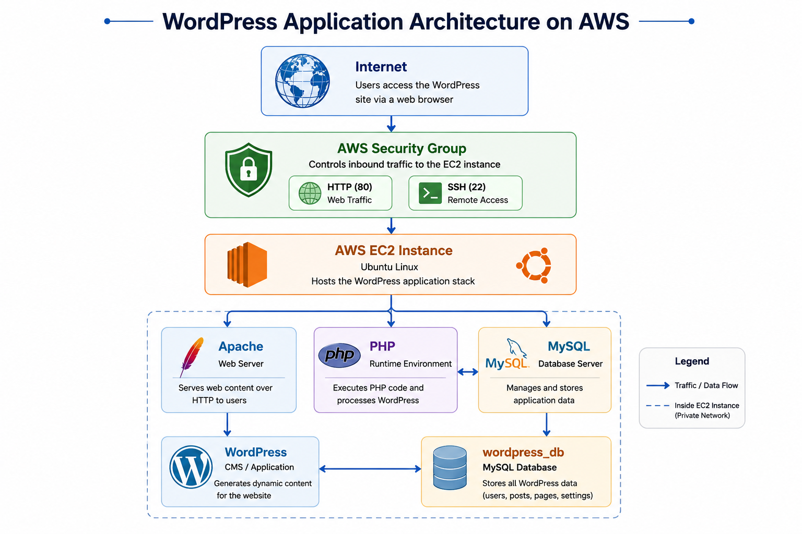
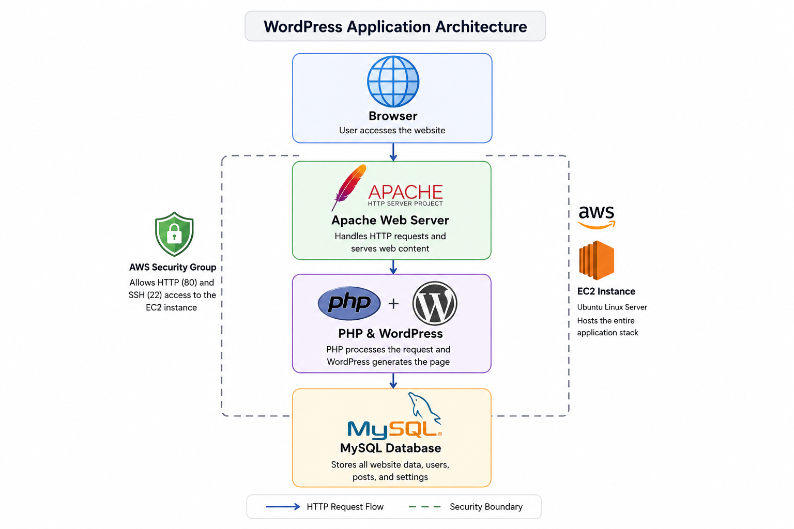

# Legacy System Modernization Lab

## Project Overview

This project demonstrates the deployment of a WordPress application stack on AWS as a hands-on cloud infrastructure project.

The goal was to provision an Ubuntu EC2 server using **Terraform**, configure the server with **Apache, PHP, and MySQL**, deploy **WordPress**, verify that the application was operational, and finally remove the infrastructure using Terraform.

Rather than manually creating the infrastructure through the AWS Management Console, Terraform was used to define and provision the AWS resources as code.

---

## Architecture

The project used a single AWS EC2 instance running Ubuntu to host the complete WordPress application stack.

Traffic from the internet was controlled through an **AWS Security Group**, with HTTP (port 80) used for web traffic and SSH (port 22) used for remote server administration.

Inside the EC2 instance, Apache served web requests, PHP provided the runtime required by WordPress, and MySQL provided the database layer.



*High-level architecture of the WordPress application stack deployed on AWS EC2.*

---

## Skills Demonstrated

- Infrastructure as Code (IaC)
- AWS EC2 provisioning
- Terraform
- Linux server administration
- SSH remote administration
- Apache web server configuration
- PHP runtime installation
- MySQL database administration
- WordPress deployment
- Linux file ownership and permissions
- Git version control
- GitHub project documentation
- Cloud resource lifecycle management

---

## Technologies Used

| Technology | Purpose |
|---|---|
| AWS EC2 | Cloud compute instance |
| Terraform | Infrastructure provisioning and lifecycle management |
| Ubuntu Linux | Server operating system |
| Apache | Web server |
| PHP | Server-side runtime for WordPress |
| MySQL | Relational database |
| WordPress | Web application / CMS |
| SSH | Secure remote server access |
| Git | Version control |
| GitHub | Source control and project documentation |

---

# Deployment Walkthrough

## 1. Infrastructure Provisioning with Terraform

I used Terraform to provision the AWS infrastructure instead of manually creating the resources through the AWS Management Console.

The Terraform configuration defined the EC2 instance and security group required for the WordPress server. An existing AWS EC2 key pair was associated with the instance to allow SSH access.

This approach allowed the infrastructure configuration to be stored as code and provided a repeatable way to create and later remove the environment.

After applying the Terraform configuration, the EC2 instance entered the **Running** state and passed its AWS status checks.


*AWS EC2 instance running successfully after infrastructure provisioning.*

Terraform outputs were used to retrieve the public IP address and public DNS name of the server.

The Terraform state also confirmed that the EC2 instance, security group, and Ubuntu AMI data source were being managed or referenced by the configuration.


*Terraform output and state information used to verify the provisioned infrastructure.*

---

## 2. Server Preparation and SSH Access

After provisioning the EC2 instance, I connected to the Ubuntu server using SSH.

SSH provided secure remote command-line access to the instance so that the operating system and application stack could be configured.


*SSH session established with the Ubuntu EC2 instance.*

The Ubuntu package repositories and installed packages were updated before application software was installed.

Keeping the server updated ensured that current package information and available security updates were applied before configuring the application environment.

---

## 3. Web Stack Installation

WordPress requires multiple components to operate as a dynamic web application.

I installed:

- **Apache** to receive HTTP requests and serve web content.
- **PHP** to execute the server-side WordPress application code.
- **MySQL** to provide persistent relational data storage.

This helped demonstrate how the different layers of a traditional web application stack work together rather than treating WordPress as a standalone application.

After installation, Apache and MySQL were started and configured to start automatically with the server.

I verified the status of both services using `systemctl`.


*Apache and MySQL verified as active and running on the Ubuntu server.*

Verifying the services before continuing was important because WordPress depends on both the web server and database service being operational.

---

## 4. Database Configuration

Before connecting WordPress to MySQL, I performed the MySQL secure installation process.

The configuration included security measures such as:

- Removing anonymous MySQL users
- Disabling remote root login
- Removing the default test database
- Reloading the MySQL privilege tables

I then created a dedicated database for the application:

```text
wordpress_db
```

A separate MySQL user was created for WordPress and granted privileges specifically to the WordPress database.

Using a dedicated application database account avoids requiring WordPress to connect to MySQL using the administrative root account.


*MySQL verification showing the dedicated `wordpress_db` database.*

Database credentials and passwords are intentionally excluded from the repository documentation.

---

## 5. WordPress Deployment

After preparing the web and database services, I downloaded and extracted WordPress on the Ubuntu server.

The WordPress application files were moved into Apache's document root:

```text
/var/www/html
```

The ownership of the web directory was then assigned to the Apache service account:

```text
www-data
```

This ensured that the web server had the appropriate access to the WordPress application files.


*WordPress application files deployed to Apache's document root with the appropriate ownership.*

The WordPress configuration file was then configured with the database connection information required by the application, including:

- Database name
- Database user
- Database password
- Database host

Sensitive credentials are intentionally not displayed in this repository.

After completing the configuration, Apache was restarted and its status was verified before accessing the application through a web browser.

---

## 6. Final Application Verification

After configuring the server, database, and WordPress application, I accessed the EC2 instance through its public IP address in a web browser.

The WordPress installation process completed successfully.


*WordPress confirming that the application installation completed successfully.*

I then authenticated to the WordPress administration dashboard.


*Successfully authenticated WordPress dashboard, confirming that the deployed application was operational.*

Reaching the WordPress dashboard verified that the individual application components were communicating successfully.

A browser request reached the Apache web server, PHP executed the WordPress application code, and WordPress interacted with MySQL to retrieve and store application data.



*Application request flow through the deployed WordPress stack.*

At this point, the complete WordPress application stack was operational on the AWS EC2 instance.

---

## 7. Infrastructure Cleanup

After validating the completed deployment, I used Terraform to remove the AWS infrastructure created for the project.

```bash
terraform destroy
```

Terraform generated a destruction plan showing the managed resources that would be removed and required confirmation before proceeding.


*Terraform successfully removing the project infrastructure after deployment verification.*

The final Terraform output confirmed:

```text
Destroy complete! Resources: 2 destroyed.
```

Destroying the resources after completing the project prevented unnecessary AWS infrastructure from remaining active.

It also demonstrated the complete Terraform resource lifecycle:

```text
Write Configuration
        |
        v
terraform plan
        |
        v
terraform apply
        |
        v
Deploy & Validate
        |
        v
terraform destroy
```

---

## Security Considerations

Security was considered throughout the project rather than only during application deployment.

The following practices were incorporated:

- SSH access used an EC2 key pair rather than password-based server authentication.
- AWS Security Group rules controlled inbound access to the EC2 instance.
- MySQL remote root login was disabled.
- Anonymous MySQL users were removed.
- The default MySQL test database was removed.
- WordPress used a dedicated database user instead of the MySQL root account.
- Terraform state files are excluded from the GitHub repository.
- Private key files are excluded from the GitHub repository.
- Environment files are excluded from the GitHub repository.
- Database passwords and application credentials are not included in the project documentation.

The repository's `.gitignore` file prevents several sensitive or unnecessary files from being committed:

```gitignore
.terraform/
*.tfstate
*.tfstate.*
*.pem
.env
```

This is particularly important for Terraform projects because state files can contain infrastructure information that should not be published in a public repository.

---

## Repository Structure

```text
legacy-system-lab/
|
|-- main.tf
|-- .terraform.lock.hcl
|-- .gitignore
|-- README.md
|
`-- screenshots/
    |-- 01-ec2-instance-running.png
    |-- 02-terraform-output-state.png
    |-- 03-ubuntu-ssh-session.png
    |-- 04-apache-mysql-running.png
    |-- 05-wordpress-database.png
    |-- 06-wordpress-files-permissions.png
    |-- 07-wordpress-install-success.png
    |-- 08-wordpress-dashboard.png
    |-- 09-terraform-destroy.png
    |-- architecture-overview.png
    `-- application-request-flow.png
```

Terraform state files, Terraform working directories, private keys, and environment files are intentionally excluded from the repository.

---

## Key Lessons Learned

### Infrastructure as Code

Using Terraform helped me understand how cloud infrastructure can be defined in configuration files instead of being created entirely through a graphical console.

I gained practical experience with the Terraform workflow of planning, applying, verifying, and destroying infrastructure.

### Linux Administration

Working directly with Ubuntu provided hands-on experience with package management, Linux file permissions, service management, and remote administration through SSH.

### Web Application Architecture

Installing the individual application components helped me better understand the responsibilities of Apache, PHP, MySQL, and WordPress.

Rather than viewing WordPress as a single application, I could see how requests move through multiple layers before application data is stored or returned to the user.

### Database Administration and Security

Creating a dedicated WordPress database and database user demonstrated why applications should use purpose-specific credentials instead of administrative database accounts.

The MySQL secure installation process also introduced several basic database-hardening practices.

### Troubleshooting

The deployment required checking service status, correcting configuration issues, working with Linux permissions, and validating each component before progressing to the next stage.

This reinforced the importance of troubleshooting infrastructure systematically instead of changing multiple components at once.

### Git and GitHub

This project also introduced me to the Git workflow of initializing a repository, staging changes, committing work, connecting a local repository to GitHub, pushing changes, and documenting technical work through a README.

---

## Challenges and Troubleshooting

Several issues occurred during the deployment and became useful troubleshooting exercises.

For example, MySQL's password validation policy initially rejected a database password that did not meet the configured requirements. I corrected this by using a password that satisfied the active security policy before creating the WordPress database user.

I also worked through WordPress file placement and configuration issues, verified Linux ownership and permissions, and repeatedly checked Apache and MySQL service status while troubleshooting the deployment.

These experiences reinforced a practical troubleshooting process:

```text
Identify the problem
        |
        v
Read the error/output
        |
        v
Check the affected service or configuration
        |
        v
Make one corrective change
        |
        v
Verify the result
```

---

## Future Improvements

This project intentionally used a relatively simple architecture so that I could focus on understanding the individual infrastructure and application components.

Future versions of the project could explore:

- **Ansible** for automated server configuration
- **Docker** for application containerization
- **CI/CD** for automated infrastructure and application deployments
- **Amazon RDS** to separate the database from the EC2 application server
- **HTTPS/TLS** for encrypted web traffic
- **Route 53** and a custom domain
- More restrictive network and security group design
- Centralized monitoring and logging
- Automated infrastructure validation and testing
- Remote Terraform state management
- Terraform modules for reusable infrastructure components

These improvements would build on the foundation established in this project and move the architecture toward a more automated, scalable, and production-oriented design.

---

## Project Outcome

The project successfully demonstrated the complete lifecycle of deploying a WordPress application stack on AWS:

**Provision → Configure → Deploy → Verify → Destroy**

Terraform provisioned the AWS infrastructure, Ubuntu provided the server environment, Apache and PHP served the application, MySQL provided the database layer, and WordPress was successfully installed and accessed through its administrative dashboard.

After successful verification, the infrastructure was removed using Terraform.

This project provided hands-on experience connecting cloud infrastructure, Linux administration, web services, databases, Infrastructure as Code, application deployment, troubleshooting, and Git-based documentation into a single end-to-end workflow.